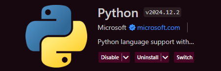
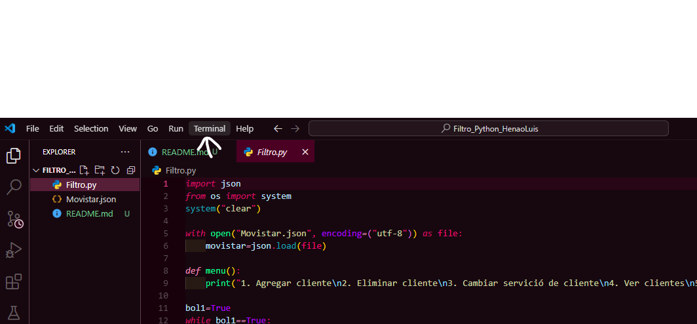
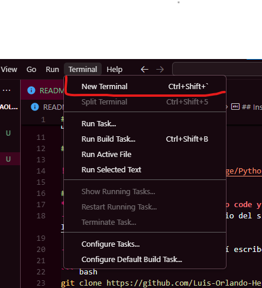
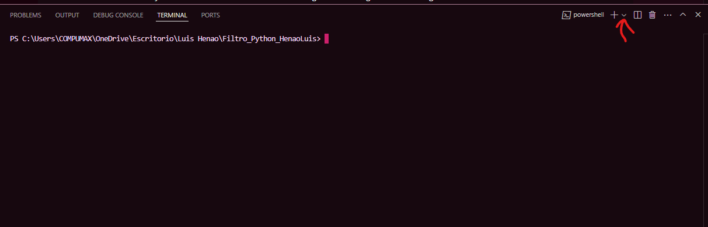

# Gestion  de clientes de movistar

Es  un programa de gestion de base de datos de clientes de movitsar usando un archivo json. en este programa se muestra un menu con 6 opciones las cuales son
- Agregar cliente
- Eliminar cliente
- Cambiar servicio de cliente
- Ver clientes
- Cambiar fidelizacion del cliente
- Salir
Cada una de estas opciones funcionales haciendo que programa tenga el CRUD (Create (Crear), Read (Leer), Update (Actualizar) y Delete (Borrar).)

## Tecnologias usadas


## Instalación y Uso
**Debes tener instalado visual studio code, python y git en su ultima version**
- Para ello debes clonar el directorio del siguiente link de git hub https://github.com/Luis-Orlando-Henao-Bermon/Introduccion_LuisHenao

- Abre la terminal de git bash y allí escribe el siguiente comando:     

``` bash 
git clone https://github.com/Luis-Orlando-Henao-Bermon/Introduccion_LuisHenao
```
- Abre visual studio code e instalas la extencion de python





- Abres una nueva terminal de git dando siguiendo las siguientes instrucciones:









- Y finalmente ejecutas el siguiente comando
```bash
python filtro.py
```

## Créditos

Desarrollado por Luis Orlando Henao Bermon C.C.*1093904929*